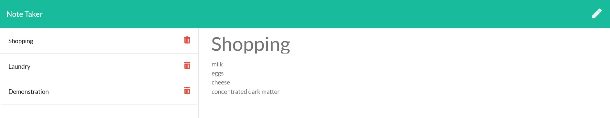

# Note Taker

## Description

This application lets a user save and retrieve notes.

## Table of Contents

- [Usage](#usage)
- [Questions](#Questions)
- [License](#License)

## Usage

## Questions

Questions? Reach out to me:

GitHub: [comatosino](https://github.com/comatosino)

Email: adamsiii.robert@gmail.com

## License
    
This project is covered under the [MIT](https://opensource.org/licenses/MIT) license.
    

